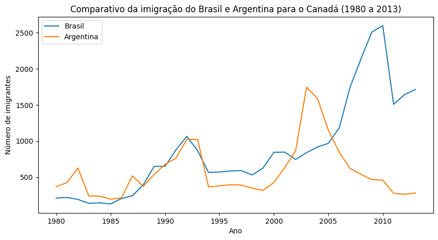
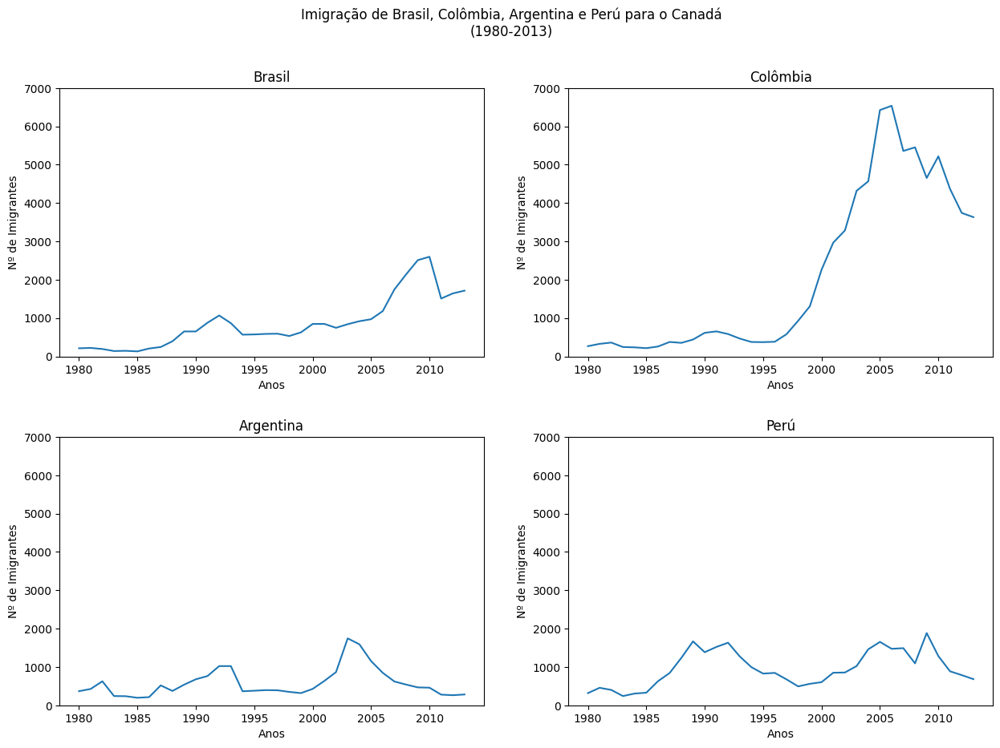
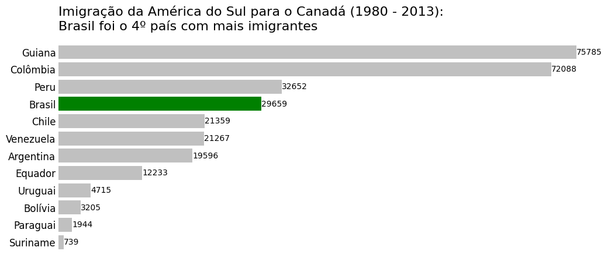
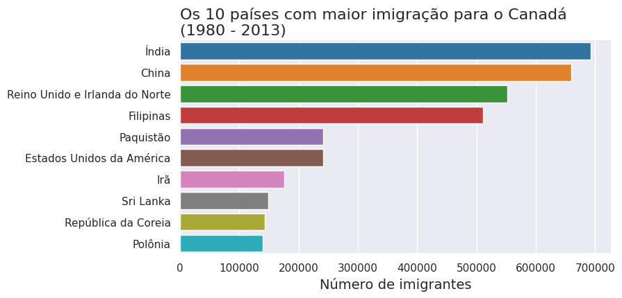

# Ideias geradas durante o desenvolvimento das análises

## Comparativo da imigração do Brasil e Argentina para o Canadá (1980 a 2013)

  

Analisando o gráfico, nota-se um aumento expressivo da imigração de brasileiros para o Canadá entre 2005 até meados de 2010 onde visualiza-se uma queda acentuada.

Pesquisando notícias, destaco duas que podem explicar esse aumento no período de tempo destacado:
- No final de 2007 foi noticiado que o Canadá anunciou financiamento para acolhimento de imigrantes (https://workpermit.com/news/canada-announces-settlement-funding-immigrants-20071210)
- Uma notícia publicada em 2010 traz entrevistas com brasileiros que estão vivendo e trabalhando no Canadá (https://www.gazetadopovo.com.br/economia/pos-e-carreira/brasileiros-descobrem-o-canada-para-viver-e-trabalhar-17pt7zbop1z1pt8un1i3hz2a6/)

Já a queda notada até 2010 pode ser explicada pela Crise Financeira Global de 2008 que atingiu muitos países, inclusive o Canadá. Vide notícia em:
- https://economia.uol.com.br/noticias/redacao/2024/07/04/o-ano-em-que-o-mundo-quebrou-entenda-a-crise-financeira-de-2008.htm 

Com relação a Argentina, a imigração para o Canadá foi similar ao Brasil até 2000, porém uma crise atingiu o país em 2001 como lemos neste artigo, o que pode explicar o aumento acentuado de argentinos no Canadá nos anos 2000 a 2005.
- https://www.suno.com.br/artigos/crise-argentina/

## Imigração de Brasil, Colômbia, Argentina e Perú para o Canadá (1980-2013)

  

Observa-se que a Colômbia possuiu uma imigração para o Canadá muito acentuada entre 1995 e 2005. Este artigo do Migration Policy Institute esmiúça um grave problema ocorrido no país envolvendo conflitos armados e crise econômica. Link: 
- https://www.migrationpolicy.org/journal/country-profile/colombia-crossfire

Além disso, duas notícias da ACNUR (Agência da ONU para Refugiados) podem ajudar a entender um pouco mais esses dados:
- https://www.unhcr.org/news/colombias-congress-calls-attention-grave-human-rights-situation-bogotas
- https://www.unhcr.org/news/unhcr-concerned-about-conflict-colombias-border-areas-urges-neighbours-keep

## Imigração da América do Sul para o Canadá (1980 - 2013)
### Brasil foi o 4º país com mais imigrantes

  

O que pode explicar a Guiana como o país da América do Sul com mais imigrantes para o Canadá pode estar relacionado ao seu histórico de tensões políticas como visto em:
- https://en.wikipedia.org/wiki/Guyanese_community_in_Toronto
- https://books.openedition.org/obp/15162

Além desses pontos, ambos os países mantém uma boa relação bilateral como documentado pelo Governo do Canadá:
- https://www.international.gc.ca/country-pays/guyana/relations.aspx?lang=eng

Existe ainda um projeto de diáspora organizada de guianenses como pode ser vista em:
- https://www.iom.int/news/guyanese-diaspora-project-launched-canada

## Os 10 países com maior imigração para o Canadá (1980 - 2013)

  

Sobre a Índia ser o país com maior imigração para o Canadá entre 1980 e 2013, estes dois artigos podem ajudar a entender o processo:
- https://www.forbes.com/sites/stuartanderson/2024/04/25/indians-immigrate-to-canada-in-record-numbers/
- https://www.cicnews.com/2014/04/story-indian-immigration-canada-043365.html
